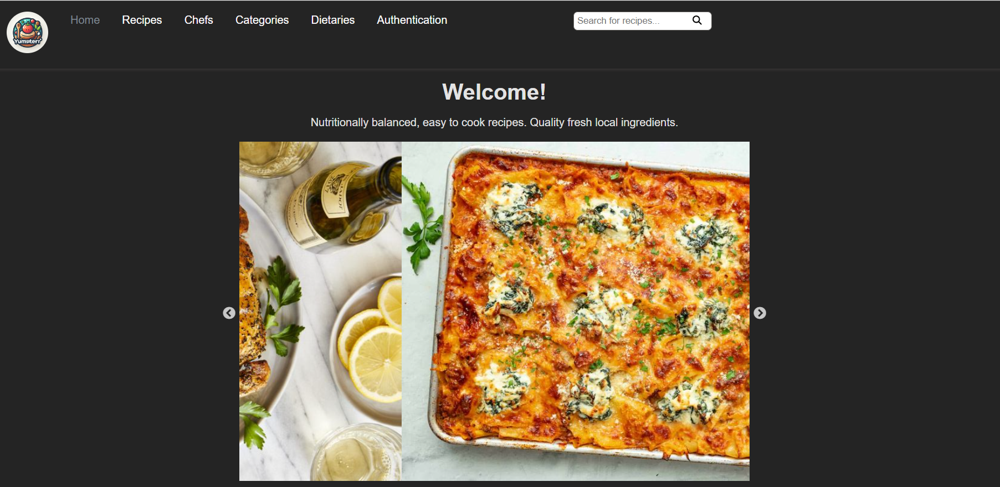
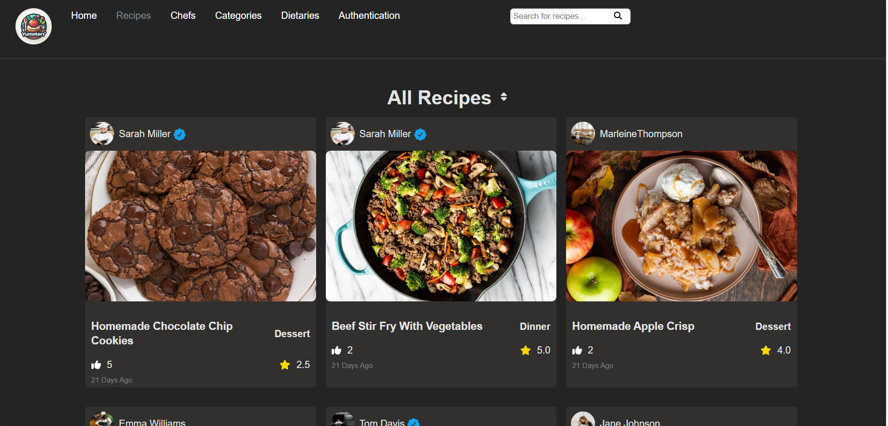

# 🍴 Recipe Sharing Platform

Welcome to our **Recipe Sharing Platform**, a web application designed to bring culinary enthusiasts together! Share your favorite recipes, discover new ones, and interact with fellow food lovers.






## 🌟 Features

**📖 Single-Page Layout**
- Navigate seamlessly through a beautifully designed single-page application.

**🎨 Styled with React-Bootstrap and CSS**
- Easily customizable colors and themes to suit your taste.

**📱 Fully Responsive**
- Enjoy a consistent and user-friendly experience.

### 🍳 Core Functionalities

- **User Authentication**
  - Secure registration and login via email/password.
  
- **User Profiles**
  - Create, view, and update personal profiles.

- **Recipe Management**
  - Add, edit, and delete recipes with detailed descriptions and images.

- **Interactivity**
  - Like, comment, rate, and save your favorite recipes. 

- **Search and Navigation**
  - Find recipes by tags, ingredients, keywords, or categories. Utilize sort and filter options for easy browsing.


## 🚀 Getting Started

Clone this repository to get started. Ensure you have `node.js` and `git` installed globally on your machine.

### 🛠 Installation and Setup Instructions

1. **Clone the repository:**
   ```bash
   git clone https://github.com/fidaahammoud/webRecipeFood.git

   cd webRecipeFood

2. **Install dependencies:**
   ```bash
    npm install

3. **Start the development server:**
   ```bash
    npm start

Runs the app in the development mode.\
Open [http://localhost:3000](http://localhost:3000) to view it in the browser. 
The page will reload if you make edits.

```markdown
## 📚 Learn More

For more information about using React, check out the  [React documentation](https://reactjs.org) 
